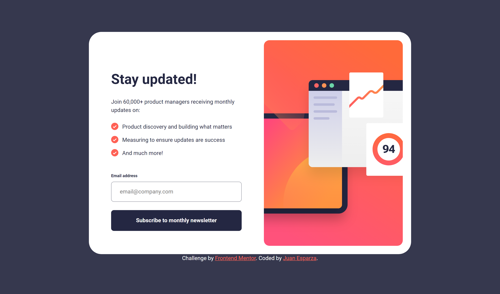

# Frontend Mentor - Newsletter sign-up form with success message solution

This is a solution to the [Newsletter sign-up form with success message challenge on Frontend Mentor](https://www.frontendmentor.io/challenges/newsletter-signup-form-with-success-message-3FC1AZbNrv). Frontend Mentor challenges help you improve your coding skills by building realistic projects.

## Table of contents

- [Overview](#overview)
  - [The challenge](#the-challenge)
  - [Screenshot](#screenshot)
  - [Links](#links)
- [My process](#my-process)
  - [Built with](#built-with)
  - [What I learned](#what-i-learned)
  - [Continued development](#continued-development)
- [Author](#author)

**Note: Delete this note and update the table of contents based on what sections you keep.**

## Overview

### The challenge

Users should be able to:

- Add their email and submit the form
- See a success message with their email after successfully submitting the form
- See form validation messages if:
  - The field is left empty
  - The email address is not formatted correctly
- View the optimal layout for the interface depending on their device's screen size
- See hover and focus states for all interactive elements on the page

### Screenshot

- Desktop design 
- Mobile design 

### Links

- Solution URL: [solution page](https://your-solution-url.com)
- Live Site URL: [Live preview](https://jewebdev.github.io/newsletter-signup/index.html)

## My process

### Built with

- Semantic HTML5 markup
- CSS custom properties
- Flex box
- CSS Grid

### What I learned

I learned a lot with this project

- Client side form validation with javascript and regular expressions

- How to manage the submit event on forms with javascript

- How to use custom markers for list elements

- How to show a success message on form submit

### Continued development

I want to continue learning to come back to this project and make the validation server side instead of client side. And send the form data to the server.

## Author

- Frontend Mentor - [@JEWebDev](https://www.frontendmentor.io/profile/JEWebDev)
